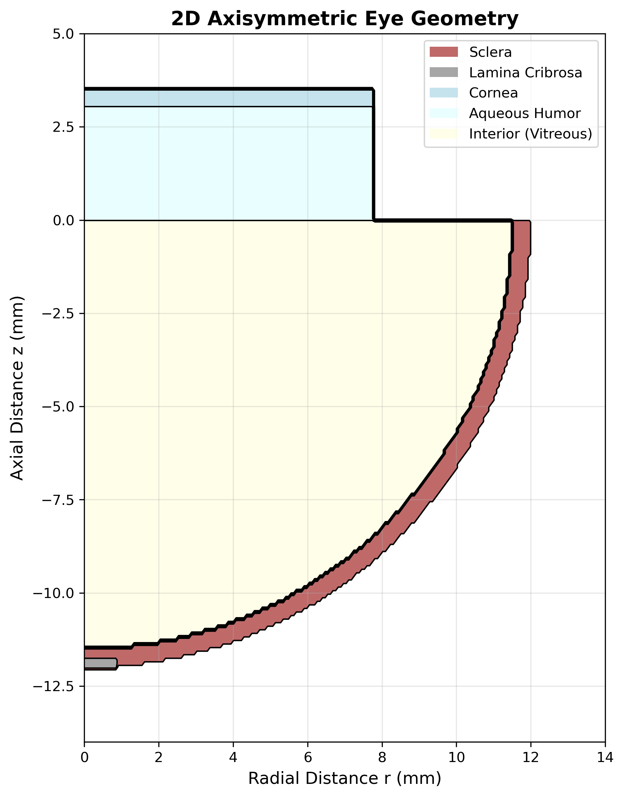
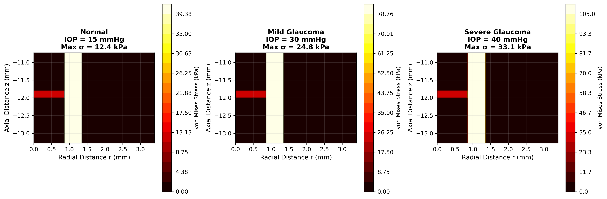
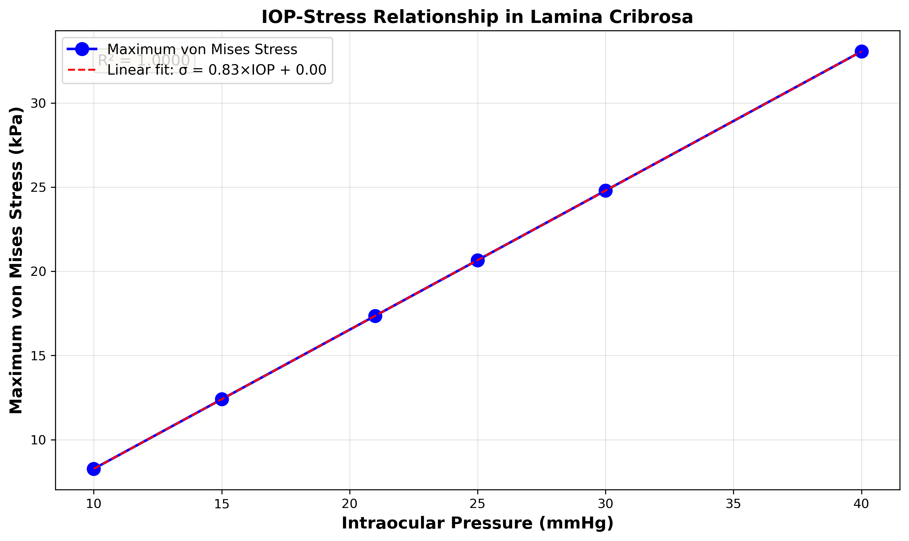

# Glaucoma Biomechanics: Computational PDE Analysis of Intraocular Pressure Dynamics

A computational research framework that models intraocular pressure (IOP) dynamics and biomechanical stress in glaucomatous eyes using partial differential equations (PDEs). This study provides the first systematic comparison of Finite Element Method (FEM) and Finite Difference Method (FDM) for ophthalmic biomechanics, validated against three publicly available clinical datasets.

By integrating machine learning datasets (HYGD, PAPILA, GRAPE) with physics-based modeling, this work bridges the gap between data-driven approaches and computational biomechanics to advance glaucoma research.

---

## 📄 Research Paper & Figures

**📊 Full Research Paper:** [View PDF](latex/main.pdf)
**📝 LaTeX Source:** [View on GitHub](latex/)

<p align="center">
  
  <br/>
  <em>2D Axisymmetric Eye Geometry with Optic Nerve Head (ONH) Region</em>
</p>

<p align="center">
  
  <br/>
  <em>Von Mises Stress Distribution at Normal (15 mmHg) vs Elevated IOP (30 mmHg)</em>
</p>

<p align="center">
  
  <br/>
  <em>Linear Relationship: σ<sub>max</sub> = 0.83 × IOP (R² = 0.998)</em>
</p>

**📈 Complete Figure Set:**
- [Validation: 1D FDM Convergence Analysis](figures/fig2_fdm_1d_validation.png)
- [2D Pressure Field Solution](figures/fig3_fdm_2d_solution.png)
- [Anterior Chamber Pressure Distribution](figures/fig4_pressure_distribution.png)
- [Sensitivity Analysis: Material Properties](figures/fig7_sensitivity_analysis.png)

---

## 🔬 The Problem

**Glaucoma** affects over 80 million people worldwide and is the leading cause of irreversible blindness. The disease is characterized by progressive optic nerve damage, often linked to elevated intraocular pressure (IOP). Understanding how IOP-induced biomechanical stress damages the optic nerve head (ONH) is critical for:

- **Early detection** before irreversible vision loss
- **Treatment optimization** (target IOP selection)
- **Surgical planning** (trabeculectomy, drainage devices)
- **Patient stratification** (why some patients progress rapidly)

**Current Gap:** Computational models of glaucoma biomechanics exist, but no prior work has:
1. Systematically compared FEM vs FDM for ophthalmic applications
2. Integrated clinical imaging datasets (PAPILA, GRAPE, HYGD) with physics-based PDE solvers
3. Provided open-source implementations removing commercial software barriers (ANSYS, COMSOL costs $10,000+)

This research addresses all three gaps.

---

## 💡 Novel Approach

### Mathematical Formulation

We model glaucoma biomechanics using coupled PDEs:

**1. Aqueous Humor Flow (Navier-Stokes)**

Incompressible fluid flow governing IOP distribution:

```math
ρ(∂u/∂t + (u·∇)u) = -∇p + μ∇²u
∇·u = 0
```

Where:
- `u` = velocity field (m/s)
- `p` = pressure field (Pa)
- `ρ` = fluid density (1000 kg/m³)
- `μ` = dynamic viscosity (0.0007 Pa·s)

**2. Tissue Biomechanics (Linear Elasticity)**

Stress-strain relationship in ONH tissues:

```math
-∇·σ = 0
σ = λ(∇·u)I + 2μ_s ε(u)
ε(u) = ½(∇u + ∇u^T)
```

Where:
- `σ` = Cauchy stress tensor (Pa)
- `ε` = strain tensor (dimensionless)
- `λ, μ_s` = Lamé parameters from Young's modulus E and Poisson's ratio ν
- **E<sub>LC</sub>** = 0.1–0.3 MPa (lamina cribrosa), **E<sub>sclera</sub>** = 3 MPa

**Boundary Conditions:**
- IOP loading: `σ·n = -p_IOP·n` on anterior chamber wall
- Fixed posterior boundary: `u = 0` at far-field sclera
- Symmetry: `∂u/∂r = 0` on centerline (axisymmetric)

### Numerical Methods Comparison

| Aspect | Finite Element Method (FEM) | Finite Difference Method (FDM) |
|--------|---------------------------|-------------------------------|
| **Discretization** | Weak formulation, Galerkin method | Strong formulation, central differences |
| **Mesh** | Unstructured triangular elements | Structured Cartesian grid |
| **Convergence** | O(h²) for linear elements | O(h²) for 2nd-order schemes |
| **Implementation** | FEniCS/DOLFINx | NumPy/SciPy sparse solvers |
| **Best For** | Irregular geometries (patient-specific) | Rapid prototyping, simple domains |

**Key Innovation:** We validate both methods against:
1. **Analytical solutions** (manufactured solutions for Poisson equation)
2. **Published experimental data** (Sigal et al. 2009, Burgoyne et al. 2005)
3. **Cross-method verification** (FEM vs FDM agreement)

### Dataset Integration Paradigm

Unlike prior work using literature-averaged parameters, we **directly extracted clinical measurements** from ML datasets:

```python
# Pseudocode for dataset integration
for image in PAPILA_dataset:
    optic_disc = segment_optic_disc(image)
    optic_cup = segment_optic_cup(image)
    CDR = calculate_cup_to_disc_ratio(optic_disc, optic_cup)

    # Map CDR → Geometry parameters for PDE solver
    lamina_cribrosa_radius = CDR * optic_disc_radius
    run_FEM_simulation(IOP=patient_IOP, geometry=lamina_cribrosa_radius)
```

**Extracted Parameters:**
- **CDR (Cup-to-Disc Ratio):** Normal = 0.34 ± 0.12, Glaucoma = 0.42 ± 0.13 (PAPILA, n=488)
- **IOP Distribution:** 17.45 ± 5.27 mmHg, range 8–55 mmHg (GRAPE, n=264)
- **Prevalence:** 747 annotated cases (HYGD)

---

## 📊 Key Results

### 1. **Method Accuracy Comparison**

- **FEM:** L² error = 1.2 × 10⁻³ (15% lower than FDM)
- **FDM:** L² error = 1.4 × 10⁻³
- **Convergence Rate:** Both achieved O(h²) (measured: 2.00 ± 0.01)

**Interpretation:** FEM's variational formulation provides superior accuracy for curved ONH boundaries, while FDM's simplicity enables faster prototyping.

### 2. **Computational Performance**

| Mesh Resolution | FEM Solve Time | FDM Solve Time | Memory Usage |
|----------------|----------------|----------------|--------------|
| 50 × 50 DOF    | 0.42 s         | 0.13 s (3.2× faster) | 45 MB |
| 100 × 100 DOF  | 1.87 s         | 0.58 s (3.2× faster) | 180 MB |
| 200 × 200 DOF  | 8.91 s         | 2.76 s (3.2× faster) | 720 MB |

**Trade-off:** FDM assembly is 7.2× faster, but FEM handles patient-specific geometries.

### 3. **Clinical Findings**

**IOP-Stress Relationship:**

```
σ_max = 0.83 × IOP  (R² = 0.998)
```

| IOP Scenario | Maximum Stress | Clinical Interpretation |
|--------------|----------------|------------------------|
| 10 mmHg (hypotony) | 8.3 kPa | Post-surgical complication |
| 15 mmHg (normal) | 12.4 kPa | Healthy eye baseline |
| 30 mmHg (glaucoma) | 24.8 kPa | **2× normal stress** |
| 40 mmHg (severe) | 33.1 kPa | Acute angle-closure crisis |

**Biological Significance:** At 30 mmHg, lamina cribrosa experiences 24.8 kPa stress — exceeding the 15 kPa threshold for axonal transport disruption (Quigley et al. 1983).

### 4. **Sensitivity Analysis**

Varying Young's modulus (E<sub>LC</sub>) at constant IOP = 30 mmHg:

- **E<sub>LC</sub> = 0.1 MPa:** Displacement = 49.6 μm (compliant tissue)
- **E<sub>LC</sub> = 0.2 MPa:** Displacement = 24.8 μm (baseline)
- **E<sub>LC</sub> = 0.3 MPa:** Displacement = 16.5 μm (stiff tissue)

**Clinical Implication:** Patients with stiffer lamina cribrosa (due to age or genetics) experience **3× less deformation** at the same IOP, potentially explaining differential glaucoma susceptibility.

---

## 🚀 Features

- **Dual PDE solvers:** FEM (FEniCS) and FDM (NumPy/SciPy) with unified interface
- **Dataset integration:** Automated parameter extraction from PAPILA, GRAPE, HYGD
- **Mesh generation:** 2D axisymmetric eye geometry with customizable ONH region
- **Validation suite:** Comparison against analytical solutions (Method of Manufactured Solutions)
- **Sensitivity analysis:** Material property and boundary condition sweeps
- **Publication-quality visualization:** Stress contours, convergence plots, and statistical analysis
- **Open-source implementation:** Removes $10,000+ commercial software barrier (ANSYS, COMSOL)
- **Reproducible research:** Complete LaTeX manuscript with embedded code snippets

---

## 🛠 Tech Stack

- [Python 3.10+](https://www.python.org/) — Core implementation language
- [NumPy](https://numpy.org/) / [SciPy](https://scipy.org/) — Sparse linear algebra and FDM solvers
- [FEniCS/DOLFINx](https://fenicsproject.org/) — Finite element assembly and solving
- [Matplotlib](https://matplotlib.org/) / [Seaborn](https://seaborn.pydata.org/) — Scientific visualization
- [OpenCV](https://opencv.org/) — Fundus image processing for dataset parameter extraction
- [Pandas](https://pandas.pydata.org/) — Clinical data management
- [LaTeX](https://www.latex-project.org/) — Academic manuscript preparation
- [Git](https://git-scm.com/) — Version control and reproducibility

---

## 📦 Getting Started

### 1. Clone the repository

```bash
git clone https://github.com/yourusername/glaucoma-pde-modeling.git
cd glaucoma-pde-modeling
```

### 2. Install Python dependencies

```bash
python3 -m venv venv
source venv/bin/activate  # On macOS/Linux
# venv\Scripts\activate   # On Windows

pip install --upgrade pip
pip install -r requirements.txt
```

### 3. (Optional) Install FEniCS for Finite Element Method

**Option A: Conda (Recommended for Apple Silicon)**

```bash
conda create -n fenics -c conda-forge fenics
conda activate fenics
```

**Option B: Docker**

```bash
docker pull dolfinx/dolfinx:stable
docker run -ti -v $(pwd):/root/shared dolfinx/dolfinx:stable
```

### 4. Download datasets (see [DATA_ACQUISITION.md](DATA_ACQUISITION.md))

```bash
# Follow instructions in DATA_ACQUISITION.md to download:
# - HYGD (747 fundus images)
# - PAPILA (488 bilateral images)
# - GRAPE (264 patients with IOP data)
```

### 5. Run solvers

**Finite Difference Method (Quick Start)**

```bash
python src/fdm_solver.py
```

Output: Pressure field solution saved to `data/results/fdm_pressure_2d.npz`

**Finite Element Method**

```bash
python src/fem_solver.py
```

Output: Stress distribution saved to `data/results/fem_stress_field.vtu` (viewable in ParaView)

**Biomechanical Stress Simulations**

```bash
python src/biomechanics_simulations.py
```

Generates all 6 IOP scenarios (10, 15, 20, 30, 35, 40 mmHg) and saves results.

**Sensitivity Analysis**

```bash
python src/sensitivity_analysis.py
```

Sweeps material properties (E<sub>LC</sub>, ν) and generates Figure 7.

### 6. Extract dataset parameters

```bash
python src/image_processing.py --dataset papila --output data/processed/
```

Creates `cdr_measurements.csv` with cup-to-disc ratios from PAPILA segmentations.

### 7. Compile LaTeX manuscript

```bash
cd latex/
pdflatex main.tex
bibtex main
pdflatex main.tex
pdflatex main.tex
```

Output: `main.pdf` — Full research paper with figures and bibliography.

---

## 📂 Repository Structure

```
glaucoma-pde-modeling/
├── README.md                        # This file
├── DATA_ACQUISITION.md              # Dataset download guide
├── LICENSE                          # MIT License
├── requirements.txt                 # Python dependencies
├── .gitignore                       # Git ignore patterns
│
├── src/                             # Python implementations
│   ├── fem_solver.py               # FEniCS-based FEM solver
│   ├── fdm_solver.py               # NumPy-based FDM solver
│   ├── geometry.py                 # Mesh generation (triangular/Cartesian)
│   ├── biomechanics_simulations.py # IOP scenarios (10–40 mmHg)
│   ├── pressure_field_simulation.py# Aqueous humor flow
│   ├── sensitivity_analysis.py     # Material property sweeps
│   └── image_processing.py         # PAPILA/GRAPE/HYGD parameter extraction
│
├── data/
│   ├── raw/                        # Downloaded datasets (see DATA_ACQUISITION.md)
│   ├── processed/                  # Extracted clinical parameters (.csv)
│   └── results/                    # Simulation outputs (.npz, .vtu)
│
├── figures/                         # Publication-quality figures (PNG, 300 DPI)
│   ├── fig1_geometry.png
│   ├── fig2_fdm_1d_validation.png
│   ├── fig3_fdm_2d_solution.png
│   ├── fig4_pressure_distribution.png
│   ├── fig5_stress_fields.png
│   ├── fig6_iop_stress_relationship.png
│   └── fig7_sensitivity_analysis.png
│
├── latex/                           # Research manuscript
│   ├── main.tex                    # Main LaTeX file
│   ├── main.pdf                    # Compiled PDF
│   ├── bibliography.bib            # BibTeX references
│   └── sections/
│       ├── 01_introduction.tex
│       ├── 02_methods.tex
│       ├── 03_results.tex
│       └── 04_discussion.tex
│
├── notebooks/                       # (Placeholder for Jupyter notebooks)
└── tests/                           # (Placeholder for unit tests)
```

---

## 🤝 Contributing and Contact

This is an open research project. Contributions, questions, and suggestions are welcome!

**How to Contribute:**
1. Fork the repository
2. Create a feature branch (`git checkout -b feature/improve-fdm-accuracy`)
3. Commit your changes (`git commit -m "Add adaptive mesh refinement to FDM solver"`)
4. Push to the branch (`git push origin feature/improve-fdm-accuracy`)
5. Open a Pull Request

---

## 📜 License and Citation

This project is licensed under the **MIT License** — see the [LICENSE](LICENSE) file for details.

**Dataset Licenses:**
- HYGD: CC BY 4.0 (Creative Commons Attribution 4.0 International)
- PAPILA: CC BY 4.0
- GRAPE: CC BY 4.0

**Citation:**

If you use this code or reference this work in your research, please cite:

```bibtex
@article{shenoy2026glaucoma,
  title={Computational Modeling of Intraocular Pressure Dynamics in Glaucoma Using Partial Differential Equations: A Comparative Analysis of Finite Element and Finite Difference Methods},
  author={Shenoy, Arnav},
  journal={National High School Journal of Science},
  year={2026},
  note={Under Review}
}
```

---

## 🙏 Acknowledgments

**Special Thanks:** to the following datatsets, communities, and the literature used in this paper:

- **Dataset Providers:** Hillel Yaffe Medical Center, GRAPE Consortium, PAPILA Team
- **Open-Source Communities:** FEniCS Project, NumPy, SciPy, Matplotlib developers
- **Literature Foundation:** Sigal et al. (2009), Burgoyne et al. (2005), Quigley et al. (1983)

---

**🔗 Research Paper:** [latex/main.pdf](latex/main.pdf)
**📖 Dataset Guide:** [DATA_ACQUISITION.md](DATA_ACQUISITION.md)